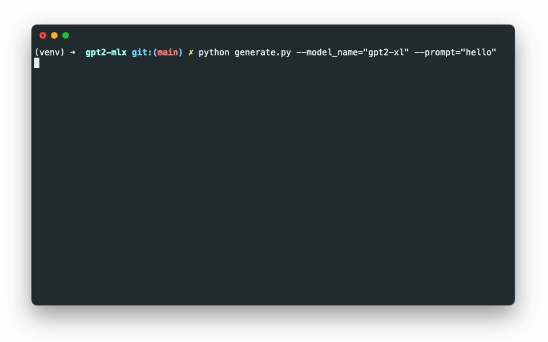

# `gpt2-mlx`

A re-implementation of GPT-2 in Apple's new machine learning framework, [MLX](https://github.com/ml-explore/mlx)

Run OpenAI's original 1.5 billion parameter model on your Mac GPU. Or train your own custom models from scratch!

<p align="center">
  
  <br>
  <em>GPT-2 XL 1.5B real-time text generation on M1 Pro 16GB</em>
</p>

## Quickstart

### Install

Use a device with Apple silicon

```shell
$ python -m venv venv
$ source venv/bin/activate
$ pip install -r requirements.txt
```

### Run

Download the pre-trained GPT-2 model weights from [Hugging Face](https://huggingface.co/gpt2-xl)

Convert the PyTorch model weights to the MLX format
```shell
$ python convert_weights.py --weights_path="path/to/pytorch_model.bin" --model_name="gpt2-xl"
```

Generate text
```shell
$ python generate.py --model_name="gpt2-xl" --prompt "In a shocking finding, scientists discovered a herd of unicorns"
```

### Train
```shell
$ python train.py
```
